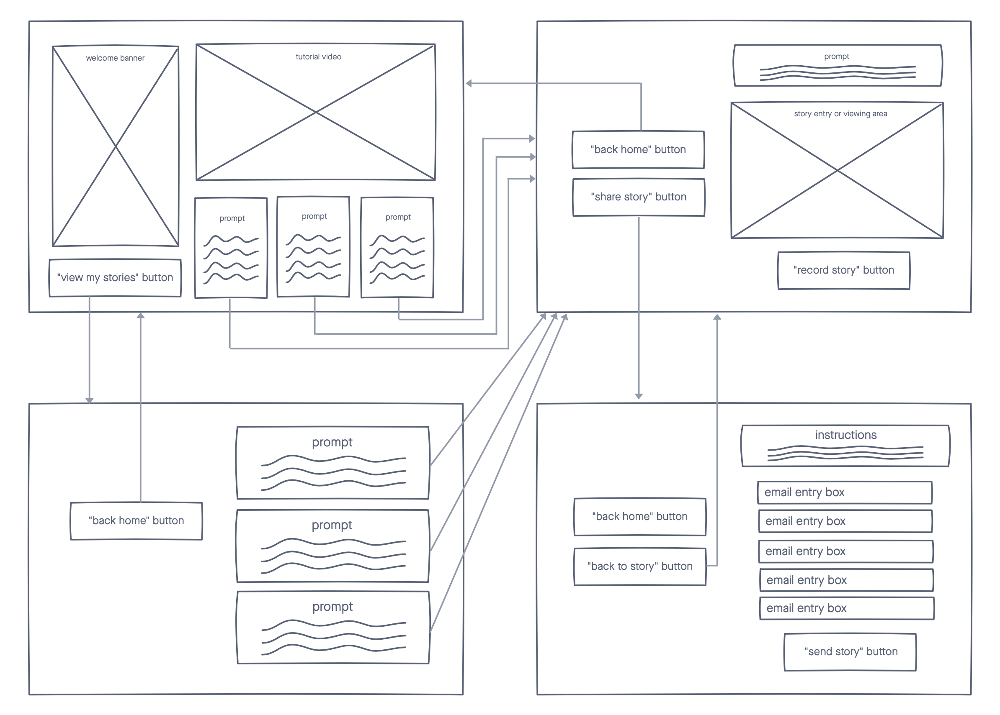
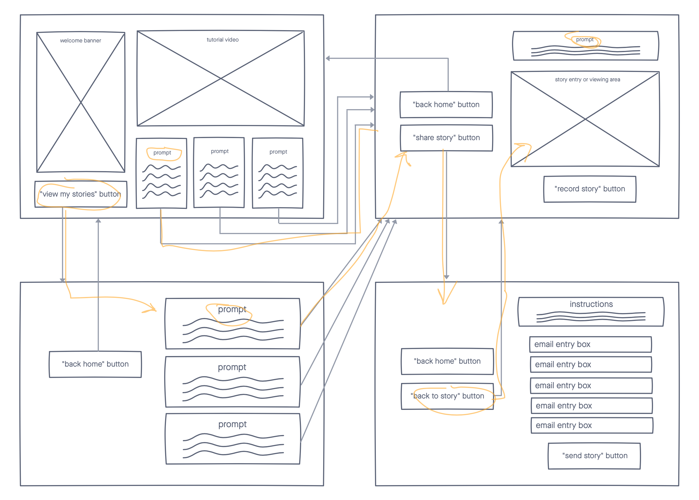
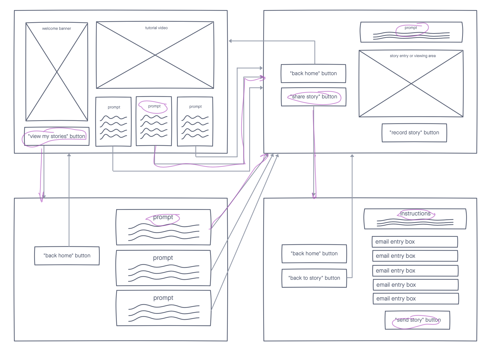

# DH110-JoyHsieh-Assignment05
## Introduction
**Purpose**: The purpose of low-fidelity prototyping is to test the functionality of an interface in the early stages of design.  
**User** **Research**: I conducted a [heuristic analysis on two competitors](https://github.com/JoyHsieh/DH110-JoyHsieh-Assignment01) to my product, a [usability test](https://github.com/JoyHsieh/DH110-JoyHsieh-Assignment02) on one of those competitors, and a [contextual inquiry](https://github.com/JoyHsieh/DH110-JoyHsieh-Assignment03) with the other.  
**Personas**: Based on the research I conducted, I created two user personas. The first is Peter Chao, a retired grandpa. The second is Marlene Williams, a young professional. Their full user personas, empathy maps, user journeys, and usage scenarios can be viewed [here](https://github.com/JoyHsieh/DH110-JoyHsieh-Assignment04).

## Features
1. **Multilingual Storytelling Platform** - provides users with prompts that cue them to share a short story about their lives. Entries can be typed, voice recorded, or video recorded in any language. Recordings are transcribed and saved with voice or video files. Entries can be quickly translated into any language
2. **Email/Text Integration** - lets users send prompts to others. When a user receives a prompt, they can reply to it with a response and it will be saved to the Storytelling Platform.
3. **Story Sharing** allows users to share their completed stories with family and friends.

## Tasks
This low-fidelity prototype supports the following tasks:
- Watch a tutorial video
- Select a prompt to write about
- Write a short story
- View all written stories
- Share a story  

This wireflow was created using Invision Freehand.

## Wireflow Test
### Tester 1: Sharon
Two issues came up during Sharon's test. First, her laptop died during the test so we had to redo one of the tasks. Second, she did not zoom out fully and did not see the full wireflow which led her to make choices that were not optimal. She did successfully complete the tasks in the end.  
_View a video of her test [here](https://youtu.be/asl24TrzXhQ)._

### Tester 2: Michelle
I wanted to try the test again to hopefully run into fewer hiccups. This time, I made sure that Michelle was charging her laptop and showed her the full wireflow before she began. She did successfully complete the tasks in the end.  
_View a video of her test [here](https://youtu.be/RV47VBmRFFw)._

## Reflection
I had a really hard time creating the wireframe in the beginning. I was overwhelmed by the number of tools available and the different modes of creation. I ultimately opted to use Invision Freehand because it is simple and I have used it before.  
The test itself didn't go as smoothly as expected, but I was glad that I was able to find a second particpant. I was glad that I was prepared to show them how to use Invision Freehand in the beginning. Next time, I want to write up the tasks and send it to the testers so they don't forget what they are trying to do.

Based on these tests, I made the following change to my wireflow:
- Have 
